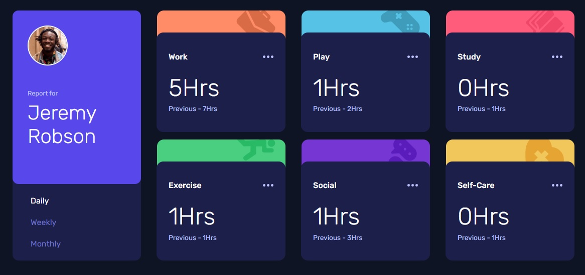

# Frontend Mentor - Time tracking dashboard solution

This is a solution to the [Time tracking dashboard challenge on Frontend Mentor](https://www.frontendmentor.io/challenges/time-tracking-dashboard-UIQ7167Jw). Frontend Mentor challenges help you improve your coding skills by building realistic projects. 

## Table of contents

- [Overview](#overview)
  - [The challenge](#the-challenge)
  - [Screenshot](#screenshot)
  - [Links](#links)
- [My process](#my-process)
  - [Built with](#built-with)
  - [Useful resources](#useful-resources)
- [Author](#author)

## Overview

### The challenge

Users should be able to:

- View the optimal layout for the site depending on their device's screen size
- See hover states for all interactive elements on the page
- Switch between viewing Daily, Weekly, and Monthly stats

### Screenshot

### Links

- Solution URL: [GitHub](https://github.com/Pablo-Zallio-Dev/time-tracking)
- Live Site URL: [Netlify](https://tracking-time.netlify.app)

## My process

### Built with

- Semantic HTML5 markup
- CSS custom properties
- Flexbox
- CSS Grid
- Mobile-first workflow
- JavaScript

### Useful resources

- [YouTube channel - CodingTube](https://www.youtube.com/@CodingTube) - It helped me to orient myself a bit with JavaScript.
- [Youtube channel - Jon MirCha](https://www.youtube.com/watch?v=GP8OCiJLeN4&list=PLvq-jIkSeTUZ6QgYYO3MwG9EMqC-KoLXA)

## Author

- Linkedin - [Pablo Zallio](https://www.linkedin.com/in/pablo-damian-zallio-zabala-140b83278/)
- GitHub - [Pablo-Zallio-Dev](https://github.com/Pablo-Zallio-Dev)
- Frontend Mentor - [@Pablo-Zallop-Dev](https://www.frontendmentor.io/profile/Pablo-Zallio-Dev)
